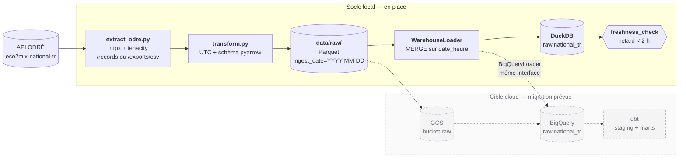

# eco2mix-data-platform

Socle d'ingestion des données **éCO2mix** de RTE (mix électrique français), exposées par la
plateforme **ODRÉ** via l'API Opendatasoft Explore v2.1.

Le pipeline extrait le dataset national temps réel, le normalise en UTC, l'écrit en Parquet
partitionné, puis le fusionne dans un warehouse **DuckDB** — le tout orchestré par **Airflow**
(Astro CLI) et exécuté **100 % en local**, sans aucun service cloud.

L'objectif est un socle de qualité production : ingestion idempotente, gestion explicite des
changements d'heure, quota d'API suivi et documenté, tests sans réseau, CI sur runner nu.

---

## Architecture



Le pipeline Airflow, en clair :

```
extract  ──►  load_raw  ──►  dbt_build  ──►  freshness_check
   │             │            (placeholder)        │
   │             └── pool duckdb_writer ───────────┘
   └── 1 appel API par run
```

### Ce qui est en place

| Composant | Fichier | Rôle |
|---|---|---|
| Client API | [`ingestion/extract_odre.py`](ingestion/extract_odre.py) | Fenêtre paramétrable, bascule `/records` ↔ `/exports/csv`, retry exponentiel, comptage du quota |
| Normalisation | [`ingestion/transform.py`](ingestion/transform.py) | `date_heure` → UTC (changements d'heure gérés), schéma pyarrow, écriture Parquet |
| Warehouse | [`ingestion/warehouse.py`](ingestion/warehouse.py) | Interface `WarehouseLoader` + `DuckDBLoader` (MERGE sur `date_heure`) |
| Étapes métier | [`ingestion/pipeline.py`](ingestion/pipeline.py) | `extract` / `load` / `freshness`, appelables par le DAG **et** par la CLI |
| Orchestration | [`airflow/dags/eco2mix_hourly_ingest.py`](airflow/dags/eco2mix_hourly_ingest.py) | DAG `@hourly`, `catchup=False`, pool `duckdb_writer` |

### Hors périmètre de cette itération

Les emplacements existent, le contenu viendra :

- `dbt/` — modèles staging + marts (la tâche `dbt_build` est un `EmptyOperator`) ;
- `infra/` — Terraform GCP pour la cible cloud ;
- DAG de consolidation mensuelle (dataset définitif `eco2mix-national-cons-def`).

---

## Démarrage

### Prérequis

- Python 3.12, [uv](https://docs.astral.sh/uv/)
- Docker + [Astro CLI](https://www.astronomer.io/docs/astro/cli/install-cli) (pour Airflow)

### Socle Python

```bash
uv sync --group dev
cp .env.example .env
```

Un run complet à la main, sans Airflow :

```bash
uv run python -m ingestion.cli ingest
```

Vérification du résultat (critère de recette) :

```bash
duckdb data/warehouse/eco2mix.duckdb "SELECT count(*) AS lignes, count(DISTINCT date_heure) AS cles, max(date_heure) AS derniere FROM raw.national_tr"
```

`lignes` et `cles` doivent être **égaux** : c'est la preuve qu'aucun doublon n'a été créé.
Relancer la commande d'ingestion ne doit pas faire bouger `lignes`.

### Airflow

```bash
cd airflow
astro dev start
```

L'UI est sur <http://localhost:8080> (`admin` / `admin`). Le DAG `eco2mix_hourly_ingest`
apparaît activé ; `astro dev stop` arrête la stack.

`docker-compose.override.yml` monte deux volumes dans les conteneurs :

| Hôte | Conteneur | Mode |
|---|---|---|
| `ingestion/` | `/usr/local/airflow/ingestion` | lecture seule |
| `data/` | `/usr/local/airflow/data` | lecture-écriture |

Le contexte de build Docker d'Astro se limite au dossier `airflow/`, il ne peut donc pas
copier `../ingestion` : le code est monté à l'exécution et `PYTHONPATH=/usr/local/airflow`
le rend importable. Une image de production devrait, elle, installer le package
(`pip install eco2mix-data-platform`) plutôt que le monter.

### Qualité

```bash
uv run ruff check .
uv run ruff format --check .
uv run pytest
```

---

## Modèle de données

Table `raw.national_tr` (DuckDB), clé primaire `date_heure` :

| Colonne | Type | Commentaire |
|---|---|---|
| `date_heure` | `TIMESTAMPTZ` | **Clé du MERGE**, normalisée en UTC |
| `perimetre`, `nature` | `VARCHAR` | Métadonnées du dataset |
| `consommation`, `prevision_j1`, `prevision_j` | `DOUBLE` | MW |
| `nucleaire`, `eolien`, `solaire`, `hydraulique`, `gaz`, `fioul`, `charbon`, `bioenergies`, `pompage` | `DOUBLE` | Production par filière, MW |
| `ech_physiques`, `ech_comm_*` | `DOUBLE` | Échanges frontaliers, MW |
| `taux_co2` | `DOUBLE` | gCO₂/kWh |
| `ingested_at_utc` | `TIMESTAMPTZ` | Horodatage du run — arbitre les révisions |
| `source_dataset` | `VARCHAR` | Dataset ODRÉ d'origine |

Les mesures sont typées `DOUBLE` et non entières : l'API renvoie des valeurs nulles sur les
filières non renseignées, et des chaînes via l'export CSV.

### Idempotence

Les données temps réel de RTE sont **révisées en continu**. Le pipeline en tient compte à
trois niveaux :

1. **Fenêtre glissante de 3 h** — chaque run horaire relit les 3 dernières heures, pas la
   seule heure écoulée, pour capter les révisions.
2. **Dédoublonnage du lot** — si un même `date_heure` apparaît deux fois dans un fichier, seule
   la ligne au `ingested_at_utc` le plus récent est retenue.
3. **MERGE, jamais d'INSERT** — les clés du lot sont supprimées puis réinsérées dans une
   transaction unique, ce qui écrase les valeurs révisées sans jamais dupliquer.

La clé primaire sur `date_heure` rend cette garantie structurelle : même en cas de régression
du code de fusion, la base refuserait le doublon.

### Fuseau horaire et changements d'heure

`date_heure` est normalisé en UTC **dès l'extraction**. Le parseur accepte les deux formes que
peut renvoyer Opendatasoft :

- **ISO avec décalage** (`2026-03-29T01:45:00+01:00`) — l'instant est déjà non ambigu ;
- **heure locale naïve** (`2026-03-29 01:45:00`) — interprétée en `Europe/Paris`, avec :
  - **fin mars** — une heure locale inexistante (02:00–02:59) lève une erreur explicite plutôt
    que d'être devinée ;
  - **fin octobre** — l'heure locale 02:00–02:59 existe deux fois. L'instant précédent de la
    série tranche : première passe en heure d'été (UTC+2), seconde en heure d'hiver (UTC+1).

Les deux bascules sont couvertes par des tests dédiés
([`test_transform.py`](ingestion/tests/test_transform.py)).

---

## Consommation du quota API

L'API ODRÉ est limitée à **50 000 appels par utilisateur et par mois**. Le client compte chaque
requête HTTP réellement émise — retries compris — et la journalise en fin de run :

```
INFO ingestion.extract_odre odre_api_calls=1 dataset=eco2mix-national-tr
```

| Usage | Appels par run | Runs / mois | Total |
|---|---|---|---|
| DAG horaire (`/records`, 1 page) | 1 | 730 | **730** |
| Retries (hypothèse : 5 % des runs, 1 tentative de plus) | 1 | 37 | 37 |
| Rejeux et mise au point | 1 | ~100 | 100 |
| Backfill d'un an (`/exports/csv`) | 1 | ponctuel | ~10 |
| | | **Total** | **≈ 880 / 50 000 → 1,8 %** |

Deux décisions maintiennent ce chiffre bas :

- **une seule page par run.** La fenêtre de 3 h représente une douzaine de lignes, très en deçà
  de la page de 100 : aucune pagination n'est déclenchée en régime nominal ;
- **l'export pour les gros volumes.** Au-delà de ~900 lignes estimées, le client bascule
  automatiquement sur `/exports/csv`, qui ramène toute la fenêtre en **un seul appel**. La
  pagination de `/records` est de toute façon plafonnée (`limit` + `offset` ≤ 10 000) et ne
  permet pas un backfill.

Marge disponible : même en passant le DAG au quart d'heure (4 runs/h), la consommation
resterait autour de 3 000 appels par mois, soit 6 % du quota.

### Backfill

```bash
uv run python -m ingestion.cli ingest --start 2025-01-01 --end 2026-01-01
```

La bascule vers `/exports/csv` est automatique — un seul appel API pour l'année.

---

## Contrôle de fraîcheur

La dernière tâche du DAG lit `max(date_heure)` dans DuckDB **en lecture seule** et échoue si la
donnée la plus récente a plus de 2 h de retard (`ECO2MIX_FRESHNESS_MAX_LAG_HOURS`). Une base
vide ou absente échoue aussi : au premier run, l'absence de donnée est une anomalie, pas un
état neutre.

### Le point de friction Airflow / DuckDB

DuckDB n'accepte **qu'un seul writer** sur un fichier, et refuse un lecteur externe tant qu'un
writer détient le verrou. Trois garde-fous :

1. `max_active_runs=1` — jamais deux runs du DAG en parallèle ;
2. pool Airflow **`duckdb_writer` (1 slot)** sur `load_raw` et `freshness_check` — la
   sérialisation tient même si un autre DAG venait à écrire dans la base ;
3. connexion `read_only=True` pour le contrôle de fraîcheur.

Conséquence pratique : ne gardez pas de session `duckdb` interactive ouverte sur
`data/warehouse/eco2mix.duckdb` pendant qu'un run tourne, elle prendrait le verrou.

---

## Tests et CI

```bash
uv run pytest
```

| Suite | Couvre |
|---|---|
| [`test_extract_odre.py`](ingestion/tests/test_extract_odre.py) | Pagination, bascule vers l'export, retry, non-rejeu des 4xx, comptage du quota |
| [`test_transform.py`](ingestion/tests/test_transform.py) | Changements d'heure de mars et d'octobre, typage, partitionnement |
| [`test_warehouse.py`](ingestion/tests/test_warehouse.py) | Idempotence du MERGE, révisions, dédoublonnage, clé primaire |
| [`test_pipeline.py`](ingestion/tests/test_pipeline.py) | Bout-en-bout API simulée → Parquet → DuckDB, contrôle de fraîcheur |

**Aucun test n'appelle l'API réelle** : `pytest-httpx` intercepte au niveau du transport, et un
test condamne explicitement les sockets pour le prouver. DuckDB tourne en mémoire.

La CI GitHub Actions ([`ci.yml`](.github/workflows/ci.yml)) tourne sur un runner nu, **sans
aucun credential** :

- `ruff check` + `ruff format --check` + `pytest` ;
- import du `DagBag` avec Airflow 2.10 — les erreurs d'import du DAG sont détectées sans Docker.

---

## Chiffres clés

<!-- À remplir après le premier run réel contre l'API. -->

| Indicateur | Valeur |
|---|---|
| Lignes en base (`raw.national_tr`) | _à compléter_ |
| Profondeur d'historique | _à compléter_ |
| Pas de temps observé du dataset | _à compléter_ (attendu : 15 min) |
| Durée moyenne d'un run du DAG | _à compléter_ |
| Taille d'une partition Parquet quotidienne | _à compléter_ |
| Appels API consommés sur 30 jours | _à compléter_ (budget : ~880) |
| Retard médian de la donnée la plus récente | _à compléter_ |

---

## Migration BigQuery prévue

Aucune logique métier ne dépend de DuckDB. Le contrat est
[`WarehouseLoader`](ingestion/warehouse.py) — un `Protocol` volontairement aligné sur ce que
les deux moteurs savent faire nativement : charger **un Parquet désigné par un chemin ou une
URI**, et fusionner sur `date_heure`.

La migration se limite donc à :

1. écrire `BigQueryLoader` (`MERGE` natif, source `gs://.../*.parquet`) ;
2. l'enregistrer dans `build_loader()` — seul endroit du code où un moteur est nommé ;
3. basculer `ECO2MIX_WAREHOUSE_BACKEND=bigquery` et faire pointer la zone raw sur GCS ;
4. provisionner le tout depuis `infra/`.

Le DAG, le client API et la normalisation restent inchangés.

---

## Structure du dépôt

```
eco2mix-data-platform/
├── ingestion/              # client API, normalisation, warehouse, CLI
│   └── tests/              # pytest — aucun appel réseau
├── airflow/                # projet Astro (Airflow 2.10, Python 3.12)
│   └── dags/               # eco2mix_hourly_ingest
├── dbt/                    # à venir : staging + marts
├── infra/                  # à venir : Terraform GCP
├── data/                   # gitignoré — voir data/README.md
└── .github/workflows/      # CI : ruff, pytest, import du DagBag
```

## Source des données

[éCO2mix — données nationales temps réel](https://odre.opendatasoft.com/explore/dataset/eco2mix-national-tr/)
· ODRÉ (Open Data Réseaux Énergies) · Licence Ouverte / Open Licence Etalab.
