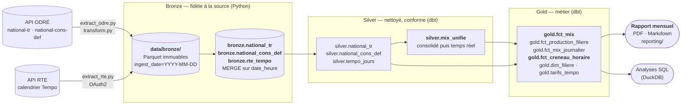

# Où brancher mon entreprise

**Diagnostic d'implantation électrique par adresse.** À partir d'une adresse française, le
projet restitue le contexte électrique du territoire — pression industrielle locale, tension du
réseau régional, mix et intensité carbone au pas 15 minutes — et chiffre le **coût horaire**
d'un profil de consommation selon le calendrier **Tempo**.

Les données viennent de **RTE** et de la plateforme **ODRÉ** (API Opendatasoft Explore v2.1).
Elles sont organisées en **architecture médaillon** (bronze → silver → gold) dans **DuckDB**,
transformées par **dbt** et orchestrées par **Airflow** (Astro CLI) — le tout **100 % en local**,
sans aucun service cloud.

Le préfixe de configuration (`ECO2MIX_*`), le fichier de base (`eco2mix.duckdb`) et le projet
dbt (`eco2mix`) gardent le nom de la source de données : ils désignent la donnée, pas le produit.

> ### Pourquoi ce cadrage, et pas « le prix et le CO₂ à votre adresse »
>
> Le [cadrage produit](docs/cadrage-besoins-entreprises.md) a invalidé la formulation
> intuitive, et c'est ce qui définit le périmètre actuel :
>
> - **le prix n'est pas géographique en France.** La péréquation tarifaire rend le TURPE
>   identique en tout point du territoire, Corse et outre-mer compris. Un « prix moyen à cette
>   adresse » renverrait la même valeur partout.
> - **il n'existe pas de facteur d'émission régional opposable.** Le réseau est interconnecté :
>   l'ADEME ne publie qu'un facteur national, et RTE ne publie le `taux_co2` qu'au niveau
>   national. Une intensité carbone « locale » serait une fausse précision.
> - **la capacité de raccordement pour la consommation n'est pas en open data.** Caparéseau ne
>   couvre que l'injection ; seule une étude RTE ou Enedis fait foi.
>
> Le projet livre donc ce qui est réellement mesurable : un **diagnostic de contexte et de
> risque**, limites affichées à côté de chaque chiffre — une exigence autant méthodologique que
> réglementaire (directive EmpCo sur les allégations environnementales).

Un **rapport mensuel** (PDF ou Markdown) sur les pics de carbone et les créneaux Tempo existe
déjà et sert de base au futur rapport d'implantation (voir
[Rapport mensuel](#rapport-mensuel--pics-de-carbone-et-créneaux-tempo)).

L'exigence technique est inchangée : ingestion idempotente, gestion explicite des changements
d'heure, quota d'API suivi et documenté, tests sans réseau, CI sur runner nu.


### Interface : une commande, pas une application

**Aucun site, aucune application.** L'outil s'utilise en clonant le dépôt et en lançant une
commande, l'adresse étant passée en argument :

```bash
uv run python -m ingestion.cli diagnose --adresse "12 rue de la Paix, 69003 Lyon"
```

La commande écrit le diagnostic dans le terminal et, à la demande, produit un rapport
(`--format pdf` ou `--format md`) en réutilisant le moteur du rapport mensuel existant. C'est
un choix assumé : le livrable est un pipeline de données et son interface en ligne de commande,
pas une vitrine web.

---

## Architecture médaillon



| Couche | Où | Construite par | Contenu | Règle |
|---|---|---|---|---|
| **Bronze** | `data/bronze/*.parquet` + schéma `bronze` | `ingestion/` (Python) | Une table par dataset ODRÉ, colonnes de la source, horodatage en UTC | Jamais de règle métier. Les Parquet gardent **toutes** les révisions ; les tables, la dernière version de chaque pas de temps |
| **Silver** | schéma `silver` | `dbt/models/silver/` | Une ligne = une mesure réelle ; qualité (`temps_reel` / `consolidee` / `definitive`) et pas de temps explicites ; série unifiée | Nettoyage et conformité, pas d'agrégat |
| **Gold** | schéma `gold` | `dbt/models/gold/` | Faits au pas de mesure et au jour, production par filière, référentiel des filières | Prêt à consommer : unités dans les noms de colonnes, regroupements issus de `dim_filiere` |

Les pipelines Airflow, en clair :

```
eco2mix_hourly_ingest          extract ──► load_bronze ──► dbt_build ──► freshness_check
eco2mix_monthly_consolidation  extract ──► load_bronze ──► dbt_build ──► coverage_check
eco2mix_monthly_report         resolve_month ──► extract_tempo ──► load_tempo ──► dbt_build ──► generate_report
  (manuel, sans planification)

load_*, dbt_build, contrôles et rapport passent par le pool duckdb_writer (1 slot).
```

### Composants

| Composant | Fichier | Rôle |
|---|---|---|
| Datasets | [`ingestion/datasets.py`](ingestion/datasets.py) | `DatasetSpec` : identifiant ODRÉ, table bronze et schéma de chaque dataset |
| Client API | [`ingestion/extract_odre.py`](ingestion/extract_odre.py) | Fenêtre paramétrable, bascule `/records` ↔ `/exports/csv`, retry exponentiel, comptage du quota |
| Client Tempo | [`ingestion/extract_rte.py`](ingestion/extract_rte.py) | API RTE en OAuth2 (jeton réutilisé), plages découpées par an, dates futures tronquées |
| Normalisation | [`ingestion/transform.py`](ingestion/transform.py) | `date_heure` → UTC (changements d'heure gérés), schéma pyarrow, écriture Parquet bronze |
| Warehouse | [`ingestion/warehouse.py`](ingestion/warehouse.py) | Interface `WarehouseLoader` + `DuckDBLoader` (MERGE sur `date_heure` dans `bronze`) |
| Étapes métier | [`ingestion/pipeline.py`](ingestion/pipeline.py) | `extract` / `load` / `freshness` / `coverage`, appelables par les DAGs **et** par la CLI |
| Silver + gold | [`dbt/`](dbt/) | Modèles, référentiel `dim_filiere`, tests de données ([détail](dbt/README.md)) |
| Rapport | [`reporting/`](reporting/) | Chiffres du mois (`data.py`), graphiques (`charts.py`), mise en page PDF (`pdf.py`) |
| Orchestration | [`airflow/dags/`](airflow/dags/) | DAG horaire (temps réel), mensuel (consolidé) et rapport à la demande, pool `duckdb_writer` |

### Pile technique

| Outil | Rôle | Pourquoi celui-là |
|---|---|---|
| **Python 3.12** | Extraction, normalisation, CLI, rapports | — |
| **dbt (dbt-duckdb)** | Couches silver et gold, tests de données | Le SQL versionné et testé est la forme la plus lisible pour des transformations analytiques |
| **Airflow** (Astro CLI) | Orchestration des trois DAGs | Standard de fait ; le projet Astro rend la stack reproductible en local |
| **DuckDB** | Warehouse local, schémas bronze / silver / gold | Un seul fichier, pas de serveur, du SQL analytique complet. L'interface `WarehouseLoader` isole ce choix pour une bascule BigQuery ultérieure |
| **Parquet** (pyarrow) | Zone bronze immuable, partitionnée par date d'ingestion | Format colonne typé, lisible par DuckDB aujourd'hui et par BigQuery demain |
| **httpx** + **tenacity** | Appels HTTP, retry exponentiel, timeouts | `tenacity` évite d'écrire une boucle de retry à la main |
| **pydantic-settings** | Configuration typée depuis l'environnement | Valide les réglages au démarrage plutôt qu'au premier appel |
| **pytest** + **pytest-httpx** | 126 tests, aucun appel réseau réel | L'interception au niveau du transport garantit qu'aucun test ne sort |
| **ruff** | Lint et format | Un seul outil pour les deux |
| **matplotlib** + **reportlab** | Graphiques et PDF du rapport | Importés paresseusement : ils ne pèsent que sur la commande de rapport |

**Pas de Spark, volontairement.** Le plus gros jeu fait 2,86 millions de lignes et le dépôt
complet tient dans 150 Mo : DuckDB traite ces volumes en quelques secondes sur un poste de
travail. Mobiliser un moteur distribué ici serait un contresens d'ingénierie, et la couche dbt
reste transposable à un moteur Spark sans réécriture du modèle si les volumes changeaient.

### Hors périmètre

- **Site web ou dashboard public** : écarté volontairement. Le livrable visible est le rapport
  mensuel, en PDF ou en Markdown ;
- envoi automatique des rapports (email) et rapports personnalisés par utilisateur ;
- `infra/` — Terraform GCP, pour une migration cloud ultérieure (voir plus bas).

---

## État d'avancement

*Mis à jour le 9 octobre 2026 — réorientation du projet vers le diagnostic d'implantation
(voir le [cadrage produit](docs/cadrage-besoins-entreprises.md), § 7 « Décision »).*

**Objectif du MVP** : une adresse française en entrée, un diagnostic de contexte électrique et
un coût horaire de profil en sortie, produits par un pipeline qui tourne sans intervention.

### Fait et testé

| Brique | Vérifié par |
|---|---|
| Ingestion éCO2mix (temps réel, consolidé/définitif) : API ODRÉ → Parquet → DuckDB | Tests sans réseau ; exécutée contre l'API réelle |
| Architecture médaillon : bronze (Python), silver et gold (dbt-duckdb) | 56 tests de données dbt, verts sur les données réelles |
| Historique complet 2012 → aujourd'hui (2 appels API) | Série continue, bilans annuels conformes aux chiffres publiés par RTE |
| Calendrier Tempo (API RTE, OAuth2) et grille tarifaire | Tests sur réponses simulées |
| Rapport mensuel PDF et Markdown (`report --format pdf/md`) | Tests de bout en bout ; généré sur septembre 2026 réel, sans prix |
| Trois DAGs Airflow (horaire, consolidation mensuelle, rapport à la demande) | Import et structure vérifiés en CI (Airflow 2.10) |
| Qualité | 91 tests pytest, ruff, CI GitHub Actions verte |

### Pas encore validé en conditions réelles

- **Airflow n'a jamais tourné** : `astro dev start` n'a pas encore été lancé (Docker Desktop
  manquait sur le poste de développement). Le projet Astro est prêt (`airflow/.astro/config.yaml`).
- **Les prix Tempo n'ont jamais été calculés sur des données réelles** : il faut des identifiants
  de l'API RTE. Le client n'est testé que sur des réponses simulées.
- **La grille tarifaire** (`dbt/seeds/tarifs_tempo.csv`) a été relevée sur un comparateur ; elle
  reste à vérifier sur la source officielle (EDF / CRE).

### Reste à faire

Le socle technique est réutilisé tel quel ; ce qui change est le périmètre fonctionnel.

| # | Étape | Fini quand |
|---|---|---|
| 1 | Lancer la stack Airflow (`astro dev start`) | Le DAG horaire est vert plusieurs heures de suite et le DAG rapport produit un document depuis l'UI |
| 2 | **Ingérer les jeux territoriaux** — *socle fait* : les quatre specs sont déclarés d'après les schémas réels, la clé de MERGE composite est en place, et deux jeux ont été chargés de bout en bout contre l'API réelle. *Reste* : déclarer les sources dbt et charger `consommation-annuelle-par-iris` et `eco2mix-regional-cons-def` | Les quatre jeux sont en bronze et en silver, tests dbt verts |
| 3 | ~~**Géocodage d'adresse**~~ — **fait** (9 octobre 2026) : `ingestion/geocode.py`, commande `geocode --adresse`, 17 tests, vérifié contre la BAN réelle | ~~Une adresse résout son territoire, hors ligne en test~~ |
| 4 | **Gold : table de diagnostic par territoire** (pression industrielle, tension réseau régionale, mix et intensité carbone, seuil de raccordement Enedis/RTE) | Une requête par code INSEE renvoie le diagnostic complet |
| 5 | **Coût horaire sur profil** : profils de consommation types, grille Tempo et TURPE vérifiées sur sources officielles | Un profil donné est chiffré créneau par créneau, avec le gain d'un décalage |
| 6 | **Rapport d'implantation par adresse** (reprend le moteur du rapport mensuel) | Un PDF est produit pour une adresse saisie, limites méthodologiques affichées |
| 7 | Fiabilité : alerte en cas d'échec d'une tâche, `main` protégée (CI obligatoire) | Un échec simulé déclenche l'alerte |
| 8 | Exploitation sur 7 jours, puis chiffres clés restants | Le tableau des [chiffres clés](#chiffres-clés) est complet |
| 9 | Vitrine : exemple de rapport et captures dans ce README | Le dépôt se comprend sans rien installer |

**Écarté explicitement** (et pourquoi, cf. cadrage) : le prix moyen par adresse (péréquation
tarifaire), l'intensité carbone régionale présentée comme opposable (pas de facteur ADEME
régional), la capacité de raccordement chiffrée (absente de l'open data pour la consommation).

---

## Démarrage

### Prérequis

- Python 3.12, [uv](https://docs.astral.sh/uv/)
- Docker Desktop (moteur WSL2 sous Windows) + [Astro CLI](https://www.astronomer.io/docs/astro/cli/install-cli)
  (pour Airflow)

### Socle Python

```bash
uv sync --group dev --group dbt --group report
cp .env.example .env
```

Un run complet à la main, sans Airflow — bronze, puis silver et gold :

```bash
uv run python -m ingestion.cli ingest
uv run python -m ingestion.cli consolidate
uv run dbt build --project-dir dbt --profiles-dir dbt
```

Puis, pour un rapport mensuel (le calendrier Tempo exige des identifiants RTE, voir
[plus bas](#calendrier-tempo--identifiants-rte)) :

```bash
uv run python -m ingestion.cli tempo --month 2026-09
uv run dbt build --project-dir dbt --profiles-dir dbt
uv run python -m ingestion.cli report --month 2026-09               # PDF
uv run python -m ingestion.cli report --month 2026-09 --format md   # Markdown
```

`dbt build` se lance depuis la racine du dépôt : `dbt/profiles.yml` lit
`ECO2MIX_DUCKDB_PATH`, avec le même défaut que le package Python.

Vérification du résultat (critère de recette) :

```bash
duckdb data/warehouse/eco2mix.duckdb "SELECT count(*) AS lignes, count(DISTINCT date_heure) AS cles, max(date_heure) AS derniere FROM bronze.national_tr"
```

`lignes` et `cles` doivent être **égaux** : c'est la preuve qu'aucun doublon n'a été créé.
Relancer la commande d'ingestion ne doit pas faire bouger `lignes`.

### Airflow

```bash
cd airflow
astro dev start
```

L'UI est sur <http://localhost:8080> (`admin` / `admin`). Les trois DAGs apparaissent :
`eco2mix_hourly_ingest` (horaire), `eco2mix_monthly_consolidation` (mensuel) et
`eco2mix_monthly_report` (sans planification, à déclencher). `astro dev stop` arrête la stack.

`airflow/.astro/config.yaml` identifie le dossier comme projet Astro ; les identifiants RTE se
placent dans `airflow/.env` (gitignoré), qu'Astro injecte dans les conteneurs.

`docker-compose.override.yml` monte trois volumes dans les conteneurs :

| Hôte | Conteneur | Mode |
|---|---|---|
| `ingestion/` | `/usr/local/airflow/ingestion` | lecture seule |
| `reporting/` | `/usr/local/airflow/reporting` | lecture seule |
| `dbt/` | `/usr/local/airflow/dbt` | lecture seule (artefacts dbt dans `/tmp/dbt`) |
| `data/` | `/usr/local/airflow/data` | lecture-écriture |

dbt est installé dans un environnement virtuel dédié de l'image
(`/usr/local/airflow/dbt_venv`, voir [`airflow/Dockerfile`](airflow/Dockerfile)) : ses
dépendances épinglées entrent en conflit avec celles d'Airflow.

Le contexte de build Docker d'Astro se limite au dossier `airflow/`, il ne peut donc pas
copier `../ingestion` : le code est monté à l'exécution et `PYTHONPATH=/usr/local/airflow`
le rend importable. Une image de production devrait, elle, installer le package
(`pip install ou-brancher-mon-entreprise`) plutôt que le monter.

### Géocoder une adresse

Premier maillon du diagnostic : l'adresse est résolue en codes administratifs, qui servent de
clés de jointure avec les jeux territoriaux.

```bash
uv run python -m ingestion.cli geocode --adresse "12 rue de la Paix, 69003 Lyon"
```

```
adresse           : 12 Rue de la Caille 69003 Lyon
commune           : Lyon (69383)
departement       : Rhône (69)
region            : Auvergne-Rhône-Alpes (84)
coordonnees       : 45.75185, 4.89474
precision / score : housenumber / 0.63
```

Deux points de méthode. La BAN ne renvoie **pas** le code IRIS : l'obtenir supposerait une
jointure spatiale avec les contours INSEE, inutile ici puisque le jeu
`consommation-annuelle-par-iris` porte déjà `code_insee_commune`. Et elle renvoie le *nom* de la
région quand ODRÉ attend son code INSEE : la correspondance est reconstituée localement sur un
nom normalisé, sans accent ni casse, parce que les deux sources n'écrivent pas
« Provence-Alpes-Côte d'Azur » de la même façon.

Le score et la précision sont affichés et journalisés : dans l'exemple ci-dessus, « rue de la
Paix » n'existe pas à Lyon 3e et la BAN a retenu la voie la plus proche, avec un score de 0,63.
C'est exactement le genre d'approximation qu'un diagnostic doit montrer plutôt que masquer.

---

### Qualité

```bash
uv run ruff check .
uv run ruff format --check .
uv run pytest
```

---

## Modèle de données

Table bronze `bronze.national_tr` (DuckDB), clé primaire `date_heure` — `bronze.national_cons_def`
suit le même schéma, enrichi du détail par sous-filière (`gaz_ccg`, `hydraulique_lacs`, …) :

| Colonne | Type | Commentaire |
|---|---|---|
| `date_heure` | `TIMESTAMPTZ` | **Clé du MERGE**, normalisée en UTC |
| `perimetre`, `nature` | `VARCHAR` | Métadonnées du dataset |
| `consommation`, `prevision_j1`, `prevision_j` | `DOUBLE` | MW |
| `nucleaire`, `eolien`, `solaire`, `hydraulique`, `gaz`, `fioul`, `charbon`, `bioenergies`, `pompage` | `DOUBLE` | Production par filière, MW |
| `ech_physiques`, `ech_comm_*` | `DOUBLE` | Échanges frontaliers, MW |
| `taux_co2` | `DOUBLE` | gCO₂/kWh |
| `ingested_at_utc` | `TIMESTAMPTZ` | Horodatage du run — arbitre les révisions |
| `source_dataset` | `VARCHAR` | Dataset ODRÉ d'origine |

Les mesures sont typées `DOUBLE` et non entières : l'API renvoie des valeurs nulles sur les
filières non renseignées, et des chaînes via l'export CSV.

### Idempotence

Les données temps réel de RTE sont **révisées en continu**. Le pipeline en tient compte à
trois niveaux :

1. **Fenêtre glissante de 3 h** — chaque run horaire relit les 3 dernières heures, pas la
   seule heure écoulée, pour capter les révisions.
2. **Dédoublonnage du lot** — si un même `date_heure` apparaît deux fois dans un fichier, seule
   la ligne au `ingested_at_utc` le plus récent est retenue.
3. **MERGE, jamais d'INSERT** — les clés du lot sont supprimées puis réinsérées dans une
   transaction unique, ce qui écrase les valeurs révisées sans jamais dupliquer.

La clé primaire sur `date_heure` rend cette garantie structurelle : même en cas de régression
du code de fusion, la base refuserait le doublon.

### Fuseau horaire et changements d'heure

`date_heure` est normalisé en UTC **dès l'extraction**. Le parseur accepte les deux formes que
peut renvoyer Opendatasoft :

- **ISO avec décalage** (`2026-03-29T01:45:00+01:00`) — l'instant est déjà non ambigu ;
- **heure locale naïve** (`2026-03-29 01:45:00`) — interprétée en `Europe/Paris`, avec :
  - **fin mars** — une heure locale inexistante (02:00–02:59) lève une erreur explicite plutôt
    que d'être devinée ;
  - **fin octobre** — l'heure locale 02:00–02:59 existe deux fois. L'instant précédent de la
    série tranche : première passe en heure d'été (UTC+2), seconde en heure d'hiver (UTC+1).

Les deux bascules sont couvertes par des tests dédiés
([`test_transform.py`](ingestion/tests/test_transform.py)).

---

## Consommation du quota API

L'API ODRÉ est limitée à **50 000 appels par dataset et par mois**, remis à zéro le 1er du mois.
Le client suit cette consommation de deux façons et journalise les deux en fin de run : ses
propres appels (retries compris) et le compteur renvoyé par l'API dans ses en-têtes
`X-RateLimit-dataset-*`, qui fait autorité.

```
INFO ingestion.extract_odre odre_api_calls=1 dataset=eco2mix-national-tr quota_remaining=49997/50000 quota_reset=2026-10-01 00:00:00+00:00
```

| Usage | Appels par run | Runs / mois | Total |
|---|---|---|---|
| DAG horaire (`/records`, 1 page) | 1 | 730 | **730** |
| Retries (hypothèse : 5 % des runs, 1 tentative de plus) | 1 | 37 | 37 |
| Rejeux et mise au point | 1 | ~100 | 100 |
| Backfill d'un an (`/exports/csv`) | 1 | ponctuel | ~10 |
| | | **Total** | **≈ 880 / 50 000 → 1,8 %** |

Deux décisions maintiennent ce chiffre bas :

- **une seule page par run.** La fenêtre de 3 h représente une douzaine de lignes, très en deçà
  de la page de 100 : aucune pagination n'est déclenchée en régime nominal ;
- **l'export pour les gros volumes.** Au-delà de ~900 lignes estimées, le client bascule
  automatiquement sur `/exports/csv`, qui ramène toute la fenêtre en **un seul appel**. La
  pagination de `/records` est de toute façon plafonnée (`limit` + `offset` ≤ 10 000) et ne
  permet pas un backfill.

Marge disponible : même en passant le DAG au quart d'heure (4 runs/h), la consommation
resterait autour de 3 000 appels par mois, soit 6 % du quota.

### Backfill

```bash
uv run python -m ingestion.cli ingest --start 2025-01-01 --end 2026-01-01
```

La bascule vers `/exports/csv` est automatique — un seul appel API pour l'année.

---

## Rapport mensuel : pics de carbone et créneaux Tempo

Un rapport pour un particulier au tarif Tempo, généré **à la demande** pour un mois civil, en
deux formats aux chiffres identiques :

- **PDF** de 3 à 4 pages, prêt à imprimer ou à envoyer ;
- **Markdown** : un document texte (tableaux, liens) lisible sur GitHub ou dans un éditeur, avec
  ses graphiques en PNG dans un dossier voisin `eco2mix_rapport_AAAA-MM_graphiques/`
  (`--sans-graphiques` pour du texte seul).

Le rapport ne recalcule aucune règle métier : tout vient de `gold.fct_creneau_horaire` (une
ligne par heure : intensité CO₂, couleur Tempo, période tarifaire, prix TTC).

| Section | Contenu |
|---|---|
| En bref | Intensité CO₂ moyenne, heure la plus propre, pic maximal, jours rouges/blancs/bleus, meilleur créneau, économie estimée |
| 1. Pics de carbone | Courbe horaire, seuil de pic (9e décile du mois), épisodes les plus intenses, jours les plus carbonés, carte jour × heure |
| 2. Calendrier Tempo et prix | Calendrier coloré du mois, jours rouges, prix et CO₂ moyens par couleur × période |
| 3. Meilleurs créneaux | Profil horaire CO₂ / prix, 5 créneaux de 3 h à privilégier, 3 à éviter, économie en déplaçant un usage flexible (7 kWh/jour par défaut) |
| Méthodologie | Définitions, sources, limites |

### Le déclencher

Dans l'UI Airflow, **Trigger DAG w/ config** sur `eco2mix_monthly_report` :

```json
{"mois": "2026-09", "tempo": true, "heures_creneau": 3, "usage_flexible_kwh": 7, "format": "pdf"}
```

Sans `mois`, le rapport porte sur le mois précédent. Il est écrit dans
`data/reports/eco2mix_rapport_AAAA-MM.pdf` (ou `.md` avec `"format": "md"`) et son chemin est
remonté en XCom. En dehors d'Airflow, la commande `report` de la CLI produit le même document.

### Calendrier Tempo : identifiants RTE

La couleur des jours vient de l'API RTE « Tempo Like Supply Contract », gratuite mais
authentifiée :

1. créer un compte sur [data.rte-france.com](https://data.rte-france.com) ;
2. s'abonner à l'API *Tempo Like Supply Contract* et créer une application ;
3. reporter ses identifiants dans `airflow/.env` (et `.env` pour la CLI) :
   `ECO2MIX_RTE_CLIENT_ID=...` et `ECO2MIX_RTE_CLIENT_SECRET=...`.

Sans identifiants, `extract_tempo` échoue avec un message explicite. Avec `"tempo": false`, le
rapport est produit sur le seul critère carbone et le signale en tête de document.

### Grille tarifaire

Les prix TTC du kWh Tempo sont dans le seed [`dbt/seeds/tarifs_tempo.csv`](dbt/seeds/tarifs_tempo.csv)
(grilles du 1er février et du 1er août 2026). **Ils doivent être mis à jour à chaque mouvement
tarifaire** (en général 1er février et 1er août) : hors grille, les prix restent nuls et le
rapport bascule sur le critère carbone plutôt que d'afficher un prix faux.

---

## Contrôle de fraîcheur

La dernière tâche du DAG lit DuckDB **en lecture seule** et échoue si la donnée la plus récente
a plus de 2 h de retard (`ECO2MIX_FRESHNESS_MAX_LAG_HOURS`). Une base vide ou absente échoue
aussi : au premier run, l'absence de donnée est une anomalie, pas un état neutre.

Le contrôle porte sur le dernier horodatage **effectivement mesuré**, pas sur `max(date_heure)`.
RTE publie en effet la ligne la plus récente « à blanc » — horodatage et échanges frontaliers
présents, consommation et production encore nulles, remplies quelques minutes plus tard. Un
contrôle basé sur `max(date_heure)` resterait donc au vert si le flux se mettait à publier des
horodatages sans jamais les remplir : précisément l'incident qu'il est censé détecter. Le log
distingue les deux :

```
INFO ingestion.pipeline freshness ok latest_measured=2026-09-08T17:45:00+00:00 latest_row=2026-09-08T18:00:00+00:00 lag_hours=0.488 rows=4
```

Ce décalage structurel (~15 à 30 min) reste très en deçà du seuil de 2 h.

### Le point de friction Airflow / DuckDB

DuckDB n'accepte **qu'un seul writer** sur un fichier, et refuse un lecteur externe tant qu'un
writer détient le verrou. Trois garde-fous :

1. `max_active_runs=1` — jamais deux runs du DAG en parallèle ;
2. pool Airflow **`duckdb_writer` (1 slot)** sur `load_bronze`, `dbt_build` et les contrôles — la
   sérialisation tient même si un autre DAG venait à écrire dans la base ;
3. connexion `read_only=True` pour le contrôle de fraîcheur.

Conséquence pratique : ne gardez pas de session `duckdb` interactive ouverte sur
`data/warehouse/eco2mix.duckdb` pendant qu'un run tourne, elle prendrait le verrou.

---

## Tests et CI

```bash
uv run pytest
```

| Suite | Couvre |
|---|---|
| [`test_extract_odre.py`](ingestion/tests/test_extract_odre.py) | Pagination, bascule vers l'export, retry, non-rejeu des 4xx, comptage du quota |
| [`test_transform.py`](ingestion/tests/test_transform.py) | Changements d'heure de mars et d'octobre, typage, partitionnement |
| [`test_warehouse.py`](ingestion/tests/test_warehouse.py) | Idempotence du MERGE, révisions, dédoublonnage, clé primaire |
| [`test_pipeline.py`](ingestion/tests/test_pipeline.py) | Bout-en-bout API simulée → Parquet → DuckDB, contrôles de fraîcheur et de complétude |
| [`test_extract_rte.py`](ingestion/tests/test_extract_rte.py) | Jeton OAuth (Basic, réutilisé), découpage des plages, dates futures, retry, couleurs inconnues |
| [`test_report.py`](ingestion/tests/test_report.py) | Épisodes de pic, meilleur créneau bleu HC, économie estimée, repli sans prix, PDF et Markdown écrits (graphiques, liens relatifs, version texte seul) |
| [`test_dbt.py`](ingestion/tests/test_dbt.py) | `dbt build` de bronze à gold : lignes vides écartées, bascule consolidé → temps réel sans double comptage, jour de 25 h, premier run sans consolidé |

Les 56 tests de données dbt (unicité, valeurs admises, bornes, intégrité référentielle, absence
de chevauchement entre mesures) tournent à chaque `dbt build`, donc à chaque run des DAGs.

**Aucun test n'appelle l'API réelle** : `pytest-httpx` intercepte au niveau du transport, et un
test condamne explicitement les sockets pour le prouver. DuckDB tourne en mémoire.

La CI GitHub Actions ([`ci.yml`](.github/workflows/ci.yml)) tourne sur un runner nu, **sans
aucun credential** :

- `ruff check` + `ruff format --check` + `pytest`, `dbt build` compris ;
- import du `DagBag` avec Airflow 2.10 — les erreurs d'import des trois DAGs, leurs tâches,
  l'usage du pool `duckdb_writer` et l'absence de planification du DAG de rapport sont vérifiés
  sans Docker.

---

## Chiffres clés

Mesurés lors du premier run de validation contre l'API (2026-09-08, fenêtre d'une heure) :

| Indicateur | Valeur |
|---|---|
| Pas de temps du dataset | **15 min** (4 lignes/heure) |
| Appels API par run horaire | **1** (`/records`, une seule page) |
| Durée d'un cycle extract + load | **~0,5 s** |
| Retard de la donnée mesurée à l'instant du contrôle | **~0,5 h** (seuil : 2 h) |
| Taille d'un fichier Parquet (4 lignes, zstd) | 8,1 ko |

Historique complet, chargé le 2026-10-04 (2 appels API au total) :

| Indicateur | Valeur |
|---|---|
| Profondeur d'historique | **1er janvier 2012 → aujourd'hui** (définitif jusqu'à fin 2024, consolidé jusqu'à juin 2026, temps réel ensuite) |
| Lignes en bronze | **508 260** (consolidé/définitif) + **9 200** (temps réel, ~96 jours) |
| Mesures dans la série unifiée (`silver.mix_unifie`) | **263 322** |
| Production par filière (`gold.fct_production_filiere`) | **2,1 millions** de lignes |
| Continuité | **14 h manquantes en 15 ans**, toutes à la source (voir [particularités](#particularités-de-la-source-rte)) |
| Backfill du consolidé (export d'un seul appel, 508 320 lignes) | **~1 min 30**, Parquet de 14 Mo |
| `dbt build` complet (66 nœuds) sur tout l'historique | **~22 s** |
| Base DuckDB (trois couches) | **139 Mo** |

<!-- À compléter après 7 jours d'exécution continue des DAGs. -->

| Indicateur | Valeur |
|---|---|
| Appels API consommés sur 30 jours | _à compléter_ (budget : ~880) |
| Taux de succès des runs du DAG horaire | _à compléter_ |

### Particularités de la source RTE

**BOM dans les exports CSV.** ODRÉ préfixe ses réponses `/exports/csv` d'un BOM UTF-8. Décodé
naïvement, il se colle au nom de la première colonne (`perimetre`), qui devient
introuvable : la colonne part à `null` sans la moindre erreur, et si cette première colonne est
une clé de MERGE, **toutes les lignes sont écartées**. Le client décode donc en `utf-8-sig`
(corrigé le 9 octobre 2026, test de non-régression dans `test_extract_odre.py`).

> Si votre base a été chargée avant ce correctif, `perimetre` y est NULL partout. Un backfill
> relancé le répare en place (un appel API par dataset), le MERGE écrasant les lignes par clé.


RTE publie **24 heures d'horloge par jour**, y compris aux changements d'heure :

- **fin mars**, l'heure locale 2 h–3 h, qui n'existe pas, est quand même publiée et retombe sur
  les mêmes instants UTC que 3 h–4 h, avec des valeurs identiques. Le dédoublonnage du
  chargement l'absorbe (4 lignes par an) ;
- **fin octobre**, l'heure locale 2 h–3 h, qui existe deux fois, n'est publiée qu'**une seule
  fois** : la première occurrence (0 h–1 h UTC) manque, sur tout l'historique. Ces journées
  ressortent avec `est_complet = false` dans `gold.fct_mix_journalier` (24 h couvertes sur 25),
  plutôt que d'être complétées par une valeur inventée.

---

## Migration BigQuery (ultérieure)

Hors périmètre actuel : la plateforme reste 100 % locale. Le code est néanmoins prêt.

Aucune logique métier ne dépend de DuckDB. Le contrat est
[`WarehouseLoader`](ingestion/warehouse.py) — un `Protocol` volontairement aligné sur ce que
les deux moteurs savent faire nativement : charger **un Parquet désigné par un chemin ou une
URI**, et fusionner sur `date_heure`.

La migration se limite donc à :

1. écrire `BigQueryLoader` (`MERGE` natif, source `gs://.../*.parquet`) ;
2. l'enregistrer dans `build_loader()` — seul endroit du code où un moteur est nommé ;
3. basculer `ECO2MIX_WAREHOUSE_BACKEND=bigquery` et faire pointer la couche bronze sur GCS ;
4. provisionner le tout depuis `infra/`.

Le DAG, le client API et la normalisation restent inchangés.

---

## Structure du dépôt

```
ou-brancher-mon-entreprise/
├── ingestion/              # clients API (ODRÉ, RTE), normalisation, warehouse, CLI
│   └── tests/              # pytest — aucun appel réseau
├── reporting/              # rapport mensuel PDF / Markdown (matplotlib + reportlab)
├── airflow/                # projet Astro (Airflow 2.10, Python 3.12)
│   └── dags/               # ingestion horaire, consolidation mensuelle, rapport à la demande
├── dbt/                    # couches silver et gold (dbt-duckdb)
├── infra/                  # à venir : Terraform GCP
├── data/                   # gitignoré — voir data/README.md
└── .github/workflows/      # CI : ruff, pytest, import du DagBag
```

## Source des données

[éCO2mix — données nationales temps réel](https://odre.opendatasoft.com/explore/dataset/eco2mix-national-tr/)
· ODRÉ (Open Data Réseaux Énergies) · Licence Ouverte / Open Licence Etalab.
